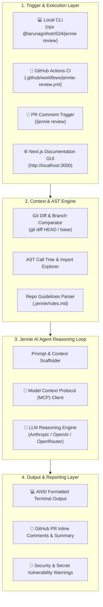
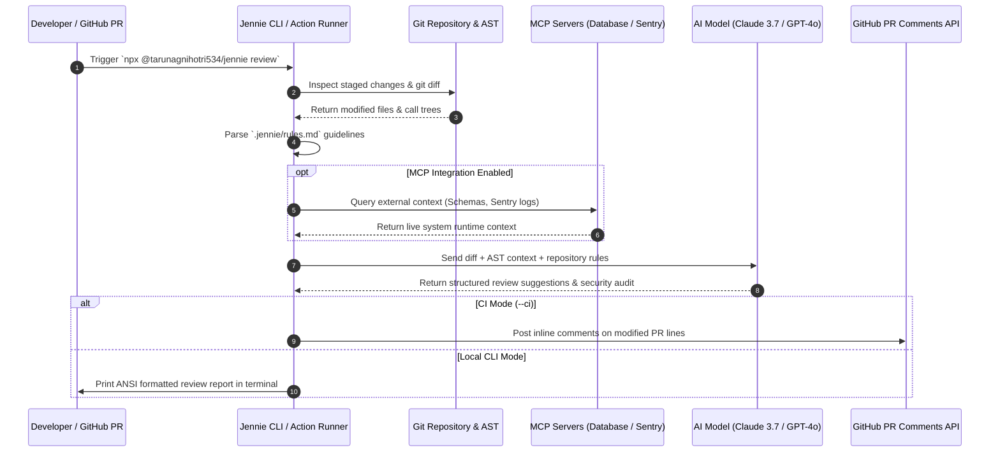

# 🏗️ System Architecture & Workflow Guide

This document outlines the system architecture, execution pipelines, agent reasoning loop, and tool integrations that power **Jennie**.

---

## 📐 High-Level System Architecture

Jennie is designed as a multi-tier agentic architecture. It decouples context gathering (git diffs, AST parsing, repo rules) from model reasoning (Anthropic, OpenAI, OpenRouter) and output dispatching (CLI terminal, GitHub Actions inline comments, Web Portal).

---

## 🔄 Execution Sequence & Reasoning Loop

When a review is triggered (locally or in CI/CD), Jennie executes the following sequential pipeline:

---

## 🧱 Component Breakdown

### 1. Trigger & Execution Layer ([`bin/jennie.js`](file:///c:/Users/darkt/OneDrive/Documents/Desktop/AlexaaaDR/bin/jennie.js))
- Serves as the primary CLI entry point for node execution.
- Parses command line flags (`--base`, `--depth`, `--mcp`, `--rules`, `--ci`, `--verbose`).
- Configures environment key fallbacks for Anthropic (`ANTHROPIC_API_KEY`), OpenAI (`OPENAI_API_KEY`), and OpenRouter (`OPENROUTER_API_KEY`).

### 2. Context & AST Engine
- **Git Comparator:** Extracts diffs against specified base branches (`--base main`).
- **Secret Scanner:** Runs static regex analysis to detect hardcoded API keys (`sk-...`, `ghp_...`, `AIza...`), tokens, and credentials before sending code to LLMs.
- **Rules Engine:** Reads `.jennie/rules.md` to inject team-specific architectural, style, and safety rules into the review prompt.

### 3. Model Context Protocol (MCP) Client
- Connects to external MCP servers to fetch live runtime context (e.g. database schemas, APM error traces, API specs).

### 4. Output & Reporting Engine
- Formats review findings into clean ANSI terminal outputs for developers.
- Scaffolds GitHub Actions PR comments using `GITHUB_TOKEN` when `--ci` mode is enabled.
